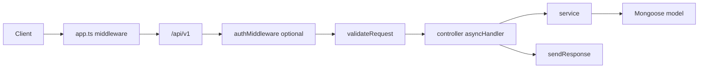

# Architecture

How this API is structured, how a request is handled, and how to add a new feature module.

## Stack

Express 5 + TypeScript, MongoDB (Mongoose 9), Zod for request and env validation, JWT for auth, Nodemailer for OTP email, Multer/Cloudinary for uploads.

## Boot path

```
npm run dev
  → ts-node-dev src/server.ts
    → mongoose.connect(config.mongodb_url)
    → app.listen(PORT, host)
    → seedingAdmin()   // creates SUPER_ADMIN if ADMIN_EMAIL is missing in DB
```

| File | Role |
|------|------|
| [`src/server.ts`](../src/server.ts) | Process entry: DNS servers, Mongo connect, listen, `uncaughtException` / `unhandledRejection` / `SIGTERM` |
| [`src/app.ts`](../src/app.ts) | Express app: global middleware, `/api` mount, health HTML, error handlers |
| [`src/config/index.ts`](../src/config/index.ts) | Loads `.env`, validates with Zod, exports `config` |
| [`src/app/routers/index.ts`](../src/app/routers/index.ts) | Mounts versioned API at `/v1` |
| [`src/app/routers/version1.ts`](../src/app/routers/version1.ts) | Registers feature routers |
| [`src/utilities/seeding.ts`](../src/utilities/seeding.ts) | Upserts super-admin from `ADMIN_EMAIL` / `ADMIN_PASSWORD` |

Listen host: `0.0.0.0` in production, otherwise `BASE_URL` or `localhost`. Port comes from `PORT` (Zod default `5000`).

Sample URL: `POST http://localhost:5000/api/v1/auth/login`.

## Request lifecycle



Order in [`src/app.ts`](../src/app.ts):

1. Static files from `src/public`
2. CORS (`origin: '*'`)
3. `urlencoded` + `json`
4. Morgan (skipped when `NODE_ENV=test`)
5. Compression + Helmet
6. Static uploads at `/v1/uploads`
7. Global rate limit: **200 requests / 5 minutes per IP** ([`rateLimit.config.ts`](../src/app/middlewares/rateLimit.config.ts))
8. `app.use('/api', routers)`
9. Health/root HTML (`/root`, `/health_check`, `/error`)
10. `globalErrorHandler`, then `notFound`

OTP-heavy routes add a tighter limiter: **5 attempts / 3 minutes** keyed by IP + email ([`otpRateLimit.ts`](../src/app/middlewares/otpRateLimit.ts)).

## Mounted modules

From [`version1.ts`](../src/app/routers/version1.ts):

| Path | Module |
|------|--------|
| `/api/v1/user` | Registration, guest, profile |
| `/api/v1/auth` | Login, OTP, password, refresh |
| `/api/v1/content` | Legal/about CMS pages |
| `/api/v1/user-habit` | User habits, today, complete/skip |
| `/api/v1/admin` | Dashboard aggregate (see below) |
| `/api/v1/progress` | Progress and analytics |
| `/api/v1/bug` | User bug reports (+ some admin) |
| `/api/v1/faq` | FAQ CRUD |

Admin sub-routers ([`src/app/modules/dashboard/index.ts`](../src/app/modules/dashboard/index.ts)):

| Path | Purpose |
|------|---------|
| `/api/v1/admin/users` | User management |
| `/api/v1/admin/overview` | Dashboard stats |
| `/api/v1/admin/quran-content` | Quran page images |
| `/api/v1/admin/adhkar-sets` | Adhkar sets and items |
| `/api/v1/admin/habit-template` | System habit catalog |
| `/api/v1/admin/bugs` | Bug triage |
| `/api/v1/admin/announcement` | Announcements |
| `/api/v1/admin/discount` | Discount codes |
| `/api/v1/admin/get-me` | Admin profile |
| `/api/v1/admin/update-profile` | Update admin name |
| `/api/v1/admin/habit/analytics` | Habit analytics table |

`habitTemplateRouter` is imported in `version1.ts` but **not mounted at top level**. It is only available under `/admin/habit-template`.

## Feature-module pattern

Each domain lives under `src/app/modules/<name>/`:

```
*.route.ts          → HTTP paths, auth, Zod, multer
*.controller.ts     → asyncHandler + sendResponse
*.service.ts        → business logic
*.model.ts          → Mongoose schema
*.interface.ts      → TypeScript types
*.zod.ts / *.validation(s).ts
*.constant.ts
```

Controllers stay thin. Services talk to models (and sometimes other modules). Shared pieces:

| Helper | Path | Use |
|--------|------|-----|
| `asyncHandler` | [`src/shared/asynchandler.ts`](../src/shared/asynchandler.ts) | Catch async errors into `next` |
| `sendResponse` | [`src/shared/sendResponse.ts`](../src/shared/sendResponse.ts) | Standard JSON envelope |
| `QueryBuilder` | [`src/builder/QueryBuilder.ts`](../src/builder/QueryBuilder.ts) | search / filter / sort / paginate |
| `jwtHelpers` | [`src/helpers/jwtHelpers.ts`](../src/helpers/jwtHelpers.ts) | Access + refresh tokens, Session upsert |
| `withTransaction` | [`src/helpers/withTransaction.ts`](../src/helpers/withTransaction.ts) | Mongo sessions |
| File upload | [`src/helpers/fileuploader.ts`](../src/helpers/fileuploader.ts) | Multer fields → Cloudinary |
| Email | [`src/utilities/sendEmail.ts`](../src/utilities/sendEmail.ts) | Gmail SMTP |

## Auth guard

[`src/app/middlewares/auth.middleware.ts`](../src/app/middlewares/auth.middleware.ts):

1. Read `Authorization: Bearer <token>`
2. Verify with `JWT_ACCESS_TOKEN_SECRET`
3. Load user by `id`; reject if missing or `deletedAt` is set
4. Reject if password changed after token `iat`
5. Reject if `status === 'BLOCKED'` (note: the check uses `'BLOCKED'` while `USER_STATUS.BLOCKED` is `'blocked'`)
6. If `requiredRoles` is non-empty, `user.role` must be in the list
7. Set `req.user`

Roles ([`user.constant.ts`](../src/app/modules/user/user.constant.ts)): `user` | `guest` | `admin` | `super-admin`.

Tokens: access + refresh. Refresh is stored on the **Session** document. Optional `isRemembered` on login stretches TTLs (access ~10d, refresh ~30d vs env defaults `1d` / `7d`).

## Response envelope

Every controller uses `sendResponse`:

```json
{
  "statusCode": 200,
  "success": true,
  "status": "success",
  "message": "optional human message",
  "meta": { "page": 1, "limit": 10, "total": 42, "totalPages": 5 },
  "data": {}
}
```

`meta` appears on paginated list endpoints. `data` may be `null`.

Errors go through [`globalHandle.error.ts`](../src/app/middlewares/globalHandle.error.ts): Zod, Mongoose validation, duplicate key `11000`, `CastError`, custom HTTP errors (`BadRequestError`, `UnauthorizedError`, …), otherwise 500.

## Uploads

Multer field names and caps ([`fileuploader.ts`](../src/helpers/fileuploader.ts)):

| Field | Max files | Max size | Used for |
|-------|-----------|----------|----------|
| `profile_image` | 1 | 1 MB | User avatar |
| `bug_images` | 10 | 1 MB each | Bug reports |
| `pages` | 30–60 | 2 MB each | Quran page images |
| `pdf` | 1 | 5 MB | Habit template PDF |

Allowed MIME: jpeg, png, jpg, webp, svg, pdf.

## How to add a module

1. Create `src/app/modules/<name>/` with route, controller, service, model, Zod, constants.
2. Keep the controller as `asyncHandler` → service → `sendResponse`.
3. Protect routes with `authMiddleware(USER_ROLE.USER, …)` and `validateRequest({ body, params, query })`.
4. Register the router in [`src/app/routers/version1.ts`](../src/app/routers/version1.ts) (or under [`dashboard/index.ts`](../src/app/modules/dashboard/index.ts) if it is admin-only).
5. Reuse `QueryBuilder` for list endpoints (`page`, `limit`, `searchTerm`, `sort`, `fields`, plus any extra filter keys).

Do not mount a router only by importing it. `habitTemplateRouter` in `version1.ts` is an example of an unused import.

## Known gaps (do not chase as live features)

- Subscription routes are not registered in `version1.ts`
- Stripe webhook in `app.ts` is commented out
- Firebase Admin and Socket.IO are unused
- Cloudinary env vars are read in config files but are **not** in the Zod `envSchema` in `src/config/index.ts`
- Three admin paths (`/get-me`, `/update-profile`, `/habit/analytics`) use `router.use(...)`, so they accept **any HTTP method**
