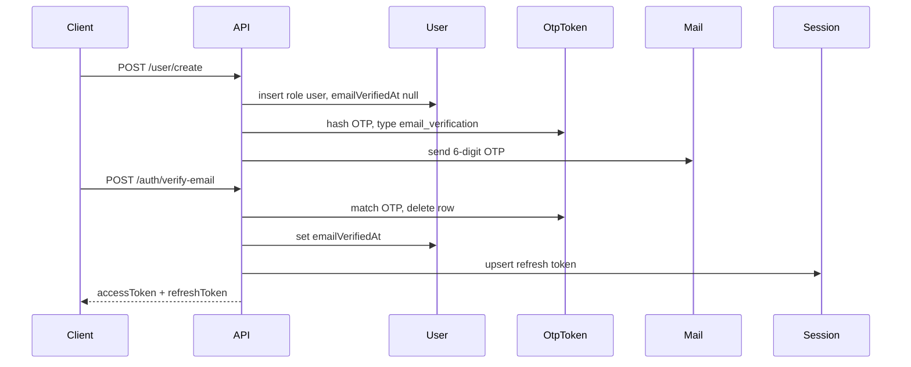
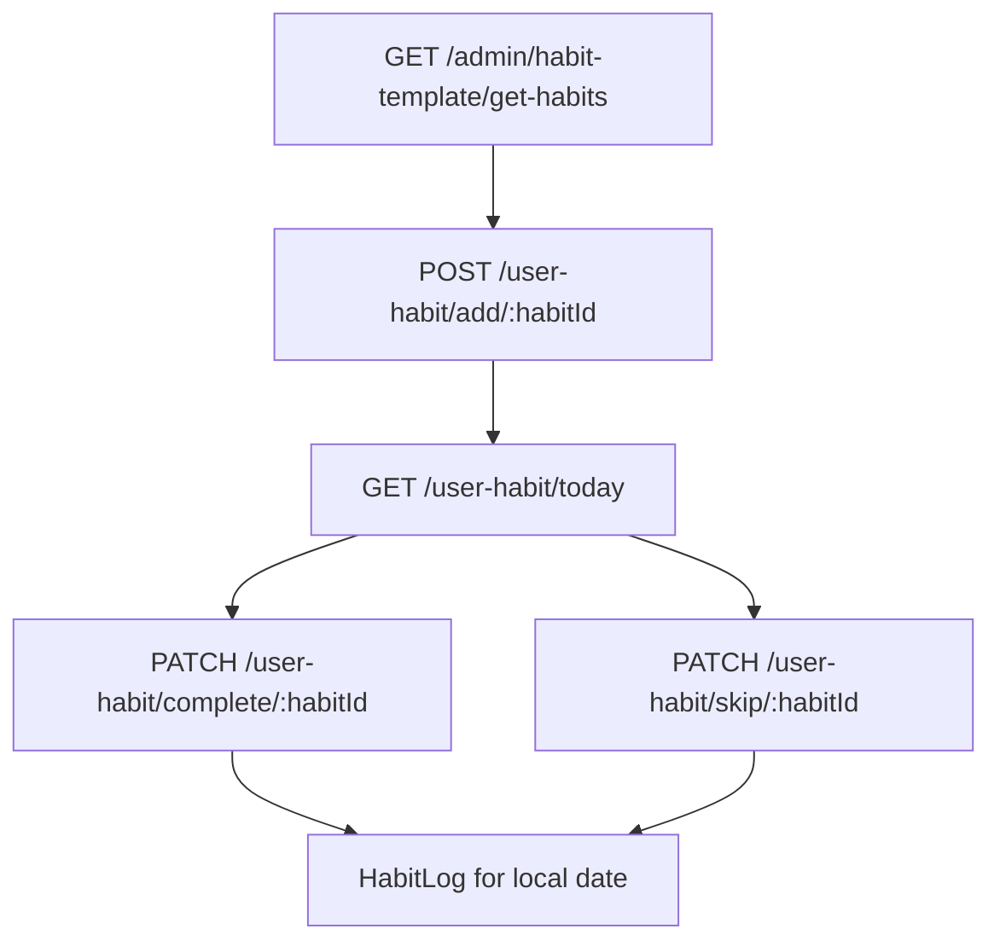

# Application flows

End-to-end journeys with the endpoints and models involved. Full request shapes are in [api-reference.md](api-reference.md). Model fields are in [models.md](models.md).

All app routes sit under `/api/v1`. Send `Authorization: Bearer <accessToken>` after login unless the route is public.

## 1. Register → OTP → tokens

1. `POST /user/create` with `fullName`, `email`, `password`, `timezone`. Creates a User (`role: user`, `status: active`) and emails an OTP. Password is bcrypt-hashed in a User `pre('save')` hook.
2. If the email already exists and is unverified (or was soft-deleted), the service resends OTP and returns `{ status: 'UNVERIFIED' }` instead of creating a duplicate.
3. `POST /auth/verify-email` with `email` + 6-digit `otp`. Matches `OtpToken` (`type: email_verification`), sets `verification.emailVerifiedAt`, deletes the OTP, issues JWT pair via `jwtHelpers.generateTokens` (upserts **Session**).
4. Resend: `POST /auth/resend-otp` (OTP rate limit). Fails if a still-valid OTP document exists (TTL has not deleted it yet).

Unverified users who call `POST /auth/login` get `400` with `{ status: 'UNVERIFIED' }` and a new OTP email.

## 2. Guest account → real user

1. `POST /user/create-guest` (public). Creates User with generated email, `role: guest`, `emailVerifiedAt` already set (no OTP). Returns tokens immediately.
2. Guest uses the same habit APIs as `user` except **custom habit create** (`POST /user-habit/custom/add` is `user` only). Templates with `isGuestLocked` may be restricted in template listing.
3. `POST /user/switch-guest-to-real` (guest JWT) with the same body as register. Sets real email/password/name/timezone, `role: user`, clears `emailVerifiedAt`, sends OTP. Client then follows verify-email like a normal signup.

## 3. Login, admin login, Google, refresh

**Email/password** — `POST /auth/login`

- Rejects deleted, blocked, or pending users.
- Social-only accounts (no password) must use social login.
- Unverified → OTP resend, no tokens.
- `disabled` users are re-activated on successful login.
- Optional `isRemembered: true` lengthens access (~10d) and refresh (~30d).

**Admin** — `POST /auth/admin/login`

Same credentials, but `role` must be `admin` or `super-admin`. Use this for the dashboard, not the mobile app.

**Google** — `POST /auth/social-login` with `provider: "google"`, `token` (ID token), `fcmToken`. Verifies against web/android/ios client IDs. Apple is in the enum but not implemented. Creates or finds the User, issues tokens.

**Refresh** — `POST /auth/refresh-token` with `{ refreshToken }`. Verifies refresh JWT, loads Session, issues a new access token.

**Change password** — `PATCH /auth/change-password` (user, admin, super-admin). Sets `passwordChangedAt`; older access tokens fail the auth middleware check.

## 4. Forgot / reset password

1. `POST /auth/forgot-password` `{ email }` → `OtpToken` type `password_reset` + email (OTP rate limit).
2. Resend: `POST /auth/reset-password-otp`.
3. `POST /auth/verify/reset-password` `{ email, otp }` → deletes OTP, returns short-lived `{ resetToken }` (`purpose: password_reset`).
4. `POST /auth/reset-password` `{ newPassword }` with header `Authorization: Bearer <resetToken>` (not the access token).

Password rules for reset/change: 6–20 chars, upper, lower, number, special `@$!%*?&#`. Registration passwords are 8–25 with the same character classes.

## 5. Browse templates → add to today → complete / skip

This is the main product loop.

1. **Catalog** — `GET /api/v1/admin/habit-template/get-habits?category=` (guest, user, super-admin). Returns published HabitTemplates with whether this user already has them active. Admin authors templates under the same `/habit-template` router (`create`, `publish`, …).
2. **Activate** — `POST /user-habit/add/:habitId` with body `{ "isActive": true }`. `habitId` is a **HabitTemplate** id (or a custom UserHabit id when deactivating). Service `toggleHabit`:
   - Group template (`group` children exist) → activate/deactivate all children.
   - `isConnectedObligatory` → activate linked obligatory prayers.
   - Otherwise clone one UserHabit from the template (`isActive: true`, frequency copied).
   - `{ "isActive": false }` deactivates.
3. **Today** — `GET /user-habit/today?category=Prayer`. Builds the list for the user’s timezone date, joining today’s HabitLog status (`Pending` / `Completed` / `Skipped`).
4. **Complete / skip** — `PATCH /user-habit/complete/:habitId` and `.../skip/:habitId` where `habitId` is the **UserHabit** `_id`. Upserts HabitLog for that date. Calling complete again on a completed log toggles back to Pending (same for skip).
5. **Detail / content** — `GET /user-habit/details/:habitId`; `GET /user-habit/content/:habitId` loads AdhkarSet or QuranContent via the linked template.
6. **Connect habits** — `GET /user-habit/search/:habitId?searchTerm=`; then `PATCH /user-habit/update/:habitId` with `connectedHabits: [id, id, ...]`.

## 6. Custom habits

`POST /user-habit/custom/add` is **user only** (not guest). Creates a UserHabit with `template: null`, `isPreBuilt: false`. Update/delete:

- `PATCH /user-habit/update/:habitId` — partial: name, frequency, reminder, location, targets, connectedHabits
- `DELETE /user-habit/custom/delete/:habitId`

Custom habits still write HabitLog through the same complete/skip endpoints.

## 7. Progress and restart

All dates use the user’s `timezone`.

- `GET /progress/overview?year=&month=&category=&analyticsView=` — combined calendar + analytics (`analyticsView` e.g. `week`). Category `all` or Prayer/Quran/Dhikr/Deeds. **Auth: user only** (not guest).
- `GET /progress/specific/:habitId?year=&month=` — one UserHabit.
- `PATCH /progress/restart/:habitId` — sets `UserHabit.progressRestartedAt` (user or guest). Later overview queries treat this as a new start.

Data source is HabitLog rows for that user’s habits.

## 8. Admin CMS

Admin (or super-admin) logs in via `/auth/admin/login`, then:

| Area | Typical order |
|------|----------------|
| Profile | `/admin/get-me`, `/admin/update-profile` `{ fullName }` |
| Overview | `/admin/overview/stats`, `user-growth?year=`, `recent-active-users` |
| Users | `/admin/users/overview`, `list`, `details/:userId`, `change-status/:userId` |
| Adhkar | Create set → add items → reorder → attach set id on a HabitTemplate |
| Quran | Create content + `pages` images → reorder/replace → attach `quranContent` on a template |
| Templates | Create (often `draft`) → publish → users see it on `get-habits` |
| Announcements / discounts | CRUD under `/admin/announcement` and `/admin/discount` |
| Habit analytics | `/admin/habit/analytics` |

Content pages (`/content`) and FAQ create are **public** in the current routes (admin auth is commented out). Listing/updating FAQs still requires admin.

## 9. Bug reports

**App (user/guest):**

1. `GET /bug/check-existing?featureKey=` — see if a similar bug already exists for that feature.
2. Either `PATCH /bug/upvote/:bugId` or `POST /bug/create` (multipart: `featureKey`, `title`, `description`, optional `bug_images`).

**Admin:**

- App router: `GET /bug/retrieve-all`, `PATCH /bug/status/:bugId`, `DELETE /bug/delete/:bugId`
- Dashboard: `GET /admin/bugs`, `GET /admin/bugs/details/:bugId`, `PATCH /admin/bugs/change-status/:bugId`

Same Bug collection.

## 10. Super-admin seed

On every server start, [`seeding.ts`](../src/utilities/seeding.ts) ensures a User exists with `ADMIN_EMAIL`, role `super-admin`, verified, status active. Use `/auth/admin/login` with `ADMIN_PASSWORD`.

Optional sample data: `npm run seed` / `npm run seed:fresh` (`src/scripts/seed.ts`).
