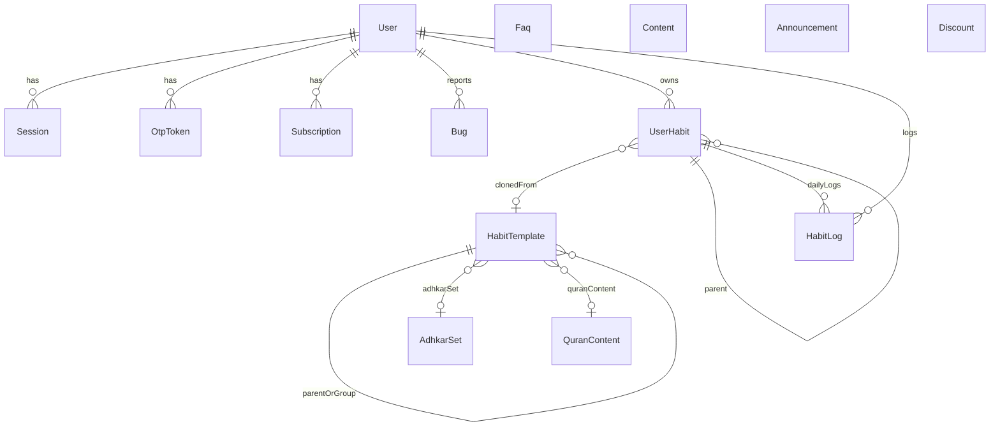

# Models and relationships

Fourteen Mongoose models. There is no Prisma or other ORM.

**User** is the identity hub. **HabitTemplate** is the admin catalog. **UserHabit** is a user’s instance of a template (or a custom habit). **HabitLog** is the daily complete/skip record.

## Entity relationship diagram

How to read this:

- **User** owns sessions, OTP rows, subscriptions, bug reports, user habits, and habit logs. Bugs also store `upvotedBy[]` as User refs.
- **HabitTemplate** is the published catalog. `parent` and `group` are self-refs (a parent habit and a group of related templates). Optional `adhkarSet` / `quranContent` attach reading content.
- **UserHabit** is created when a user activates a template (`template` set) or creates a custom habit (`template` null, `isPreBuilt` false). `parent` and `connectedHabits[].userHabit` are self-refs.
- **HabitLog** is one row per user + userHabit + date string (`YYYY-MM-DD` in the user’s timezone).
- **Faq**, **Content**, **Announcement**, **Discount** have no ObjectId foreign keys. Discount is not linked to Subscription yet.

## Auth and identity

### User

**File:** [`src/app/modules/user/user.model.ts`](../src/app/modules/user/user.model.ts)

| Field | Type | Notes |
|-------|------|-------|
| email | String | required, lowercase, trim; indexed |
| fullName | String | required, trim; indexed |
| phone | String | default `null` |
| avatar | String | default `null` (URL) |
| password | String | optional (guests / social); hashed on save |
| passwordChangedAt | Date | `select: false` |
| verification.emailVerifiedAt | Date | `null` until OTP verify |
| verification.phoneVerifiedAt | Date | unused in current flows |
| role | enum | default `user` |
| provider | enum | `google` \| `apple`, default `null` |
| isSocialLogin | Boolean | default `false` |
| timezone | String | used for “today” dates and logs |
| hasNotification | Boolean | default `false` |
| subscriptionPlan | enum | default `free` |
| notificationType | enum | default `vibrate` |
| status | enum | default `active` |
| disabledAt | Date | |
| deletedAt | Date | soft delete |
| createdAt / updatedAt | Date | timestamps |

**Enums:**

- `USER_ROLE`: `user`, `guest`, `admin`, `super-admin`
- `PROVIDER`: `google`, `apple`
- `SUBSCRIPTION_PLAN`: `free`, `premium`, `all-access`, `premium-plus`
- `NOTIFICATION_TYPE`: `vibrate`, `sound`
- `USER_STATUS`: `pending`, `active`, `blocked`, `disabled`

**Hooks / methods:** `pre('save')` bcrypt if password modified; `isUserExistsByEmail`; `isPasswordMatched`; `isJWTIssuedBeforePasswordChanged`.

Guests get a generated email, role `guest`, and `emailVerifiedAt` already set so they can use the app without OTP.

### Session

**File:** [`src/app/modules/session/session.model.ts`](../src/app/modules/session/session.model.ts)

| Field | Type | Notes |
|-------|------|-------|
| refreshToken | String | required |
| user | ObjectId → User | required |
| tokenExpiresAt | Date | required on schema |
| sessionId | String | required on schema |
| lastLoginAt | Date | |
| createdAt | Date | default now |

`jwtHelpers.generateTokens` upserts a Session per user when issuing tokens.

### OtpToken

**File:** [`src/app/modules/otp-token/otp.token.model.ts`](../src/app/modules/otp-token/otp.token.model.ts)

| Field | Type | Notes |
|-------|------|-------|
| userId | ObjectId → User | required |
| type | enum | `email_verification` \| `password_reset` |
| otpHash | String | bcrypt hashed on save |
| expiresAt | Date | TTL index `{ expireAfterSeconds: 0 }` |
| createdAt | Date | |

Mongo deletes the document when `expiresAt` is reached. Method: `isVerificationOtpMatched(plainOtp)`.

## Billing (partially unused)

### Subscription

**File:** [`src/app/modules/subscription/subscription.model.ts`](../src/app/modules/subscription/subscription.model.ts)

Present in the schema and seed data. **HTTP routes are not mounted.**

| Field | Type | Notes |
|-------|------|-------|
| user | ObjectId → User | required |
| plan | enum \| null | `matura`, `semi_matura`, `provime`, `full-access` |
| billingCycle | enum \| null | `one_month1`, `three_months` |
| price | Number | default 0 |
| status | enum | `active`, `expired`, `cancelled` |
| activatedAt / expiryDate | Date | |
| createdAt / updatedAt | Date | |

Index: `{ status: 1, activatedAt: 1 }`.

`User.subscriptionPlan` uses a **different** enum (`free` / `premium` / …) than this model.

### Discount

**File:** [`src/app/modules/dashboard/discount/discount.model.ts`](../src/app/modules/dashboard/discount/discount.model.ts)

Standalone CMS for promo codes. No ref to User or Subscription.

| Field | Type | Notes |
|-------|------|-------|
| code | String | required, indexed |
| discount | Number | percent or amount stored as number |
| discountString | String | display string (set in service) |
| appliesTo | enum | `Yearly Plan`, `Monthly Plan`, `Quarterly Plan`, `Biannual Plan` |
| usageLimit | Number | |
| status | enum | `Active`, `Expired` |
| validFrom / validUntil | Date | |
| createdAt / updatedAt | Date | |

## Habits (core product)

### HabitTemplate

**File:** [`src/app/modules/dashboard/habit-template/system.habit.model.ts`](../src/app/modules/dashboard/habit-template/system.habit.model.ts)

Admin-authored catalog. Users browse published templates and activate them into UserHabit rows.

| Field | Type | Notes |
|-------|------|-------|
| name | String | required |
| category | enum | `Prayer`, `Quran`, `Dhikr`, `Deeds` |
| connectedPrayer | enum | Fajr, Dhuhr, Asr, Maghrib, Isha And Witr, Five Prayers, Nafl, Duha, Night Prayer, or null |
| allowConnectedPrayers | [enum] | subset of prayers |
| isPrayerLocked | Boolean | default `true` |
| habitType | enum | see below |
| supportsLocation | enum | `Home`, `Masjid`, or null |
| parent | ObjectId → HabitTemplate | self-ref |
| group | ObjectId → HabitTemplate | self-ref (group header) |
| defaultFrequency | subdoc | `type`, `selectedDays[]`, `everyNDays` |
| allowedFrequencies | [enum] | `Daily`, `Weekly`, `Every_N_Days` |
| level | enum | `Beginner`, `Intermediate`, `Advanced`, `Custom` |
| isPreBuilt | Boolean | default `true` |
| isLocked / isGuestLocked | Boolean | guest lock default `true` |
| isConnectedObligatory | Boolean | activating this also activates linked obligatory prayers |
| isParent / isGroup / isNew | Boolean | tree flags |
| adhkarSet | ObjectId → AdhkarSet | optional |
| quranContent | ObjectId → QuranContent | optional |
| infoContent | String | HTML/text |
| pdfContent | String | Cloudinary URL |
| status | enum | `draft` \| `published` |
| isActive | Boolean | soft availability |
| createdAt / updatedAt | Date | |

**habitType:** `obligatory_prayer`, `sunnah_prayer`, `witr`, `duha`, `night_prayer`, `nafl`, `quran`, `adhkar`, `dhikr`, `deed`.

**Indexes:** `{ category: 1, habitType: 1 }`, `{ level: 1, levelOrder: 1 }` (`levelOrder` is indexed but not defined as a schema field).

**Parent vs group:** `isParent` marks a template that has children via `parent`. `isGroup` marks a header; children point `group` at that header. Activating a group template activates all children with `group` set to that id.

### UserHabit

**File:** [`src/app/modules/user-habit/user.habit.model.ts`](../src/app/modules/user-habit/user.habit.model.ts)

| Field | Type | Notes |
|-------|------|-------|
| user | ObjectId → User | required; indexed |
| template | ObjectId → HabitTemplate | `null` for custom habits |
| name | String | custom name; templates often keep `null` and display from template |
| category | enum | same as template: Prayer / Quran / Dhikr / Deeds |
| parent | ObjectId → UserHabit | self-ref |
| connectedPrayer | enum | optional |
| location | enum | `Home`, `Masjid`, or null |
| frequency | subdoc | required: `type`, `selectedDays`, `everyNDays` |
| allowedFrequencies | [enum] | |
| reminder | subdoc | `enabled`, `time` (`hh:mm AM/PM`) |
| startDate | Date | required |
| showOnTodayScreen | Boolean | default `true` |
| targetType | enum | `Page`, `Juzz`, `Min` |
| targetDescription | String | |
| customDetails | String | |
| connectedHabits[] | subdocs | `{ userHabit, order }` → other UserHabits |
| isPreBuilt | Boolean | `true` for template clones |
| isActive | Boolean | on the today list when true |
| progressRestartedAt | Date | set by progress restart |
| createdAt / updatedAt | Date | |

**Indexes:** `{ user: 1 }`, `{ parent: 1 }`, `{ template: 1 }`, `{ connectedPrayer: 1 }`, `{ user: 1, category: 1 }`.

Frequency types on UserHabit: `Daily`, `Weekly`, `Every_N_Days`. Week days: `mon`–`sun`.

### HabitLog

**File:** [`src/app/modules/habit-logger/habit.logger.model.ts`](../src/app/modules/habit-logger/habit.logger.model.ts)

No dedicated HTTP module. Written by user-habit complete/skip and read by progress/analytics.

| Field | Type | Notes |
|-------|------|-------|
| user | ObjectId → User | |
| userHabit | ObjectId → UserHabit | |
| date | String | required; timezone-local `YYYY-MM-DD` |
| status | enum | `Pending`, `Skipped`, `Completed` |
| skippedAt / completedAt | Date | |
| locationLogged | String | |
| createdAt / updatedAt | Date | |

Complete and skip **toggle**: Completed → Pending; Skipped → Pending; otherwise set the new status.

### AdhkarSet

**File:** [`src/app/modules/dashboard/adhkar-set/adhkar.set.model.ts`](../src/app/modules/dashboard/adhkar-set/adhkar.set.model.ts)

| Field | Type | Notes |
|-------|------|-------|
| name / nameArabic | String | |
| totalCount | Number | derived from items |
| items[] | embedded | title, arabic, transliteration, translation, virtue, reference, count, order |
| createdAt / updatedAt | Date | |

Linked from HabitTemplate.adhkarSet. User-facing content is served via `GET /user-habit/content/:habitId`.

### QuranContent

**File:** [`src/app/modules/dashboard/quran-content/quran.content.model.ts`](../src/app/modules/dashboard/quran-content/quran.content.model.ts)

| Field | Type | Notes |
|-------|------|-------|
| name / nameArabic | String | name indexed |
| totalVerses | Number | min 0 |
| pages | Number | count of images |
| images[] | `{ order, imageUrl }` | Cloudinary URLs, `_id: false` |
| createdAt / updatedAt | Date | |

Linked from HabitTemplate.quranContent.

## Support and CMS

### Bug

**File:** [`src/app/modules/bug/bug.model.ts`](../src/app/modules/bug/bug.model.ts)

| Field | Type | Notes |
|-------|------|-------|
| originalReporter | ObjectId → User | required |
| featureKey | enum | see `BUG_FEATURES` (auth, habits, progress, `other`, …) |
| title / description | String | required |
| status | enum | `pending`, `in_progress`, `resolved` |
| upvotedBy | [ObjectId → User] | |
| upvoteCount | Number | default 1 (reporter counts as first upvote) |
| bugImages | [String] | Cloudinary URLs |
| createdAt / updatedAt | Date | |

Index: `{ status: 1 }`.

### Faq

**File:** [`src/app/modules/Faq/faq.model.ts`](../src/app/modules/Faq/faq.model.ts)

`question`, `answer`, `isPublished` (default `true`), timestamps. No refs.

### Content

**File:** [`src/app/modules/content/content.model.ts`](../src/app/modules/content/content.model.ts)

Legal/about pages. `type` enum: `about-us`, `privacy-policy`, `terms-and-condition`, `refund-policy`. Plus `title`, `content`.

### Announcement

**File:** [`src/app/modules/dashboard/announcement/announcement.model.ts`](../src/app/modules/dashboard/announcement/announcement.model.ts)

`title`, `description`, `status` (`Active` / `Expired` / `Scheduled`, default Scheduled), `startedAt`, `endedAt`, timestamps.

## Shared habit enums (quick reference)

Used across HabitTemplate and UserHabit:

| Concept | Values |
|---------|--------|
| Category | Prayer, Quran, Dhikr, Deeds |
| Connected prayer | Fajr, Dhuhr, Asr, Maghrib, Isha And Witr, Five Prayers, Nafl, Duha, Night Prayer |
| Location | Home, Masjid |
| Frequency type (user) | Daily, Weekly, Every_N_Days |
| Week days | mon, tue, wed, thu, fri, sat, sun |
| Target type | Page, Juzz, Min |
| Log status | Pending, Skipped, Completed |

There is a second, lowercase set in [`src/shared/constants/habit.shared.types.ts`](../src/shared/constants/habit.shared.types.ts) (`prayer` / `daily` / `beginner`). Templates and user habits persist the **Pascal-case** values from [`src/interfaces/index.ts`](../src/interfaces/index.ts). Prefer those when writing queries.

## Module-to-model map

| Module folder | Primary model(s) |
|---------------|------------------|
| `user` | User |
| `auth` | User, Session, OtpToken |
| `session` | Session (no routes) |
| `otp-token` | OtpToken (no routes) |
| `user-habit` | UserHabit, HabitLog, HabitTemplate |
| `habit-logger` | HabitLog (no routes) |
| `habit-progress` | HabitLog, UserHabit |
| `dashboard/habit-template` | HabitTemplate |
| `dashboard/adhkar-set` | AdhkarSet |
| `dashboard/quran-content` | QuranContent |
| `bug` + `dashboard/bugs` | Bug |
| `Faq` | Faq |
| `content` | Content |
| `dashboard/announcement` | Announcement |
| `dashboard/discount` | Discount |
| `subscription` | Subscription (unmounted) |
